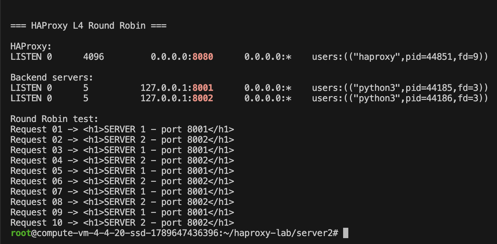
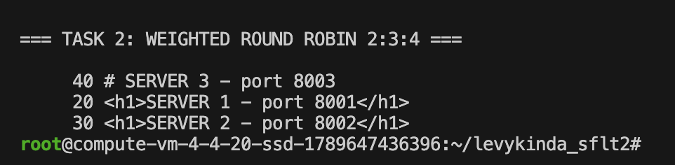
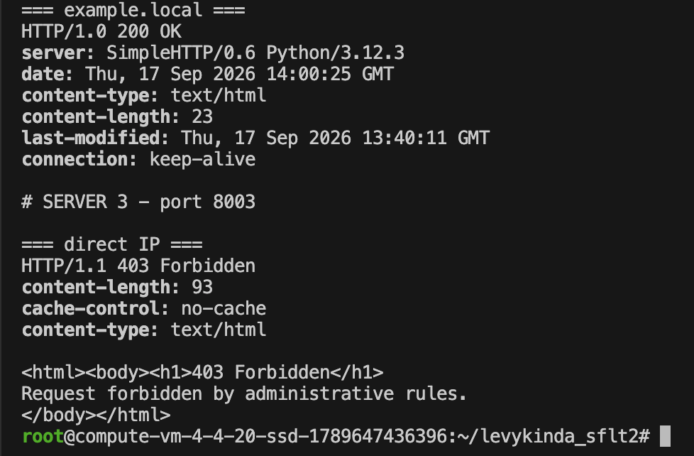
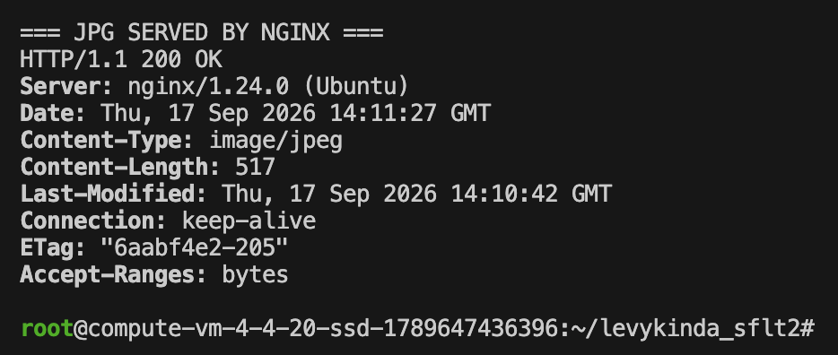
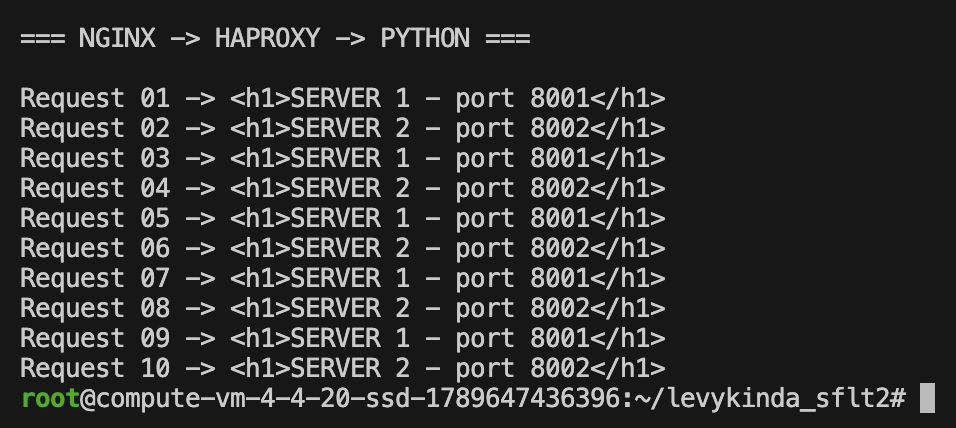
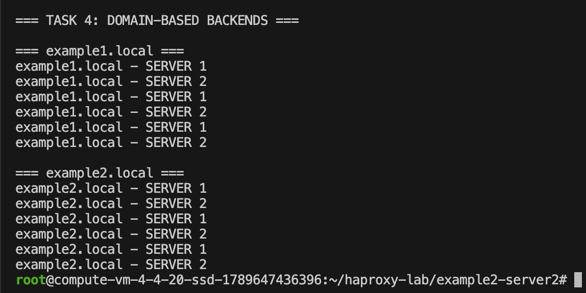

# Домашнее задание к занятию 2 «Кластеризация и балансировка нагрузки»

Выполнил: Левыкин Денис

---

## Задание 1

Запущены два Simple Python HTTP Server:

- `127.0.0.1:8001` — SERVER 1
- `127.0.0.1:8002` — SERVER 2

HAProxy настроен на балансировку нагрузки на 4 уровне модели OSI.

Используется:

- `mode tcp`
- алгоритм `roundrobin`

Конфигурационный файл:

[configs/haproxy-task1.cfg](configs/haproxy-task1.cfg)

Фрагмент конфигурации:

```haproxy
frontend task1_frontend
    bind *:8080
    mode tcp
    default_backend task1_backend

backend task1_backend
    mode tcp
    balance roundrobin
    server server1 127.0.0.1:8001 check
    server server2 127.0.0.1:8002 check
```

При последовательных запросах к HAProxy запросы распределяются между двумя backend-серверами по алгоритму Round Robin:

```text
Request 01 -> SERVER 1 - port 8001
Request 02 -> SERVER 2 - port 8002
Request 03 -> SERVER 1 - port 8001
Request 04 -> SERVER 2 - port 8002
Request 05 -> SERVER 1 - port 8001
Request 06 -> SERVER 2 - port 8002
Request 07 -> SERVER 1 - port 8001
Request 08 -> SERVER 2 - port 8002
Request 09 -> SERVER 1 - port 8001
Request 10 -> SERVER 2 - port 8002
```

Скриншот проверки:



---

## Задание 2

Запущены три Simple Python HTTP Server:

- `127.0.0.1:8001` — SERVER 1, weight 2
- `127.0.0.1:8002` — SERVER 2, weight 3
- `127.0.0.1:8003` — SERVER 3, weight 4

HAProxy настроен на балансировку нагрузки на 7 уровне модели OSI.

Используется:

- `mode http`
- `balance roundrobin`
- веса backend-серверов `2:3:4`
- ACL для домена `example.local`

Конфигурационный файл:

[configs/haproxy-task2.cfg](configs/haproxy-task2.cfg)

Фрагмент конфигурации:

```haproxy
frontend task2_frontend
    bind *:8080
    mode http

    acl is_example_local hdr(host),field(1,:) -i example.local

    http-request deny deny_status 403 if !is_example_local

    use_backend task2_backend if is_example_local

backend task2_backend
    mode http
    balance roundrobin

    server server1 127.0.0.1:8001 check weight 2
    server server2 127.0.0.1:8002 check weight 3
    server server3 127.0.0.1:8003 check weight 4
```

При 90 запросах получено распределение:

```text
20 SERVER 1 - port 8001
30 SERVER 2 - port 8002
40 SERVER 3 - port 8003
```

Распределение соответствует весам `2:3:4`.

При обращении к:

```text
http://example.local:8080
```

HAProxy возвращает успешный ответ от одного из backend-серверов.

При обращении напрямую по IP:

```text
http://127.0.0.1:8080
```

HAProxy возвращает:

```text
HTTP/1.1 403 Forbidden
```

Таким образом, балансировка выполняется только для HTTP-трафика, адресованного домену `example.local`.

Скриншоты проверки:





---

## Задание 3*

## Задание 3*

Настроена связка Nginx + HAProxy.

Nginx слушает порт `80`.

Файлы с расширением `.jpg` выдаются напрямую Nginx из директории:

```text
/var/www
```

Остальные запросы проксируются на HAProxy:

```text
127.0.0.1:8080
```

HAProxy балансирует запросы между двумя Simple Python Server:

- `127.0.0.1:8001`
- `127.0.0.1:8002`

Конфигурационные файлы:

[configs/nginx-task3.conf](configs/nginx-task3.conf)

[configs/haproxy-task3.cfg](configs/haproxy-task3.cfg)

Фрагмент конфигурации Nginx:

```nginx
server {
    listen 80 default_server;
    listen [::]:80 default_server;

    server_name _;

    root /var/www;

    location ~* \.jpg$ {
        try_files $uri =404;
    }

    location / {
        proxy_pass http://127.0.0.1:8080;

        proxy_set_header Host $host;
        proxy_set_header X-Real-IP $remote_addr;
        proxy_set_header X-Forwarded-For $proxy_add_x_forwarded_for;
    }
}
```

Проверка выдачи JPG-файла:

```text
HTTP/1.1 200 OK
Server: nginx/1.24.0 (Ubuntu)
Content-Type: image/jpeg
```

Скриншот:



Обычные запросы перенаправляются через Nginx на HAProxy и далее на Python-серверы:

```text
SERVER 1 - port 8001
SERVER 2 - port 8002
SERVER 1 - port 8001
SERVER 2 - port 8002
```

Скриншот:



---

## Задание 4*

Запущены четыре Simple Python Server.

Для сайта `example1.local`:

- `127.0.0.1:8101`
- `127.0.0.1:8102`

Для сайта `example2.local`:

- `127.0.0.1:8201`
- `127.0.0.1:8202`

В HAProxy настроены два backend:

- `backend_example1`
- `backend_example2`

В зависимости от значения HTTP-заголовка `Host` запрос направляется в соответствующий backend.

Конфигурационный файл:

[configs/haproxy-task4.cfg](configs/haproxy-task4.cfg)

Фрагмент конфигурации:

```haproxy
frontend task4_frontend
    bind *:8080
    mode http

    acl host_example1 hdr(host),field(1,:) -i example1.local
    acl host_example2 hdr(host),field(1,:) -i example2.local

    use_backend backend_example1 if host_example1
    use_backend backend_example2 if host_example2

    http-request deny deny_status 403 if !host_example1 !host_example2

backend backend_example1
    mode http
    balance roundrobin
    server example1_server1 127.0.0.1:8101 check
    server example1_server2 127.0.0.1:8102 check

backend backend_example2
    mode http
    balance roundrobin
    server example2_server1 127.0.0.1:8201 check
    server example2_server2 127.0.0.1:8202 check
```

Проверка `example1.local`:

```text
example1.local - SERVER 1
example1.local - SERVER 2
example1.local - SERVER 1
example1.local - SERVER 2
```

Проверка `example2.local`:

```text
example2.local - SERVER 1
example2.local - SERVER 2
example2.local - SERVER 1
example2.local - SERVER 2
```

Скриншот:




---

